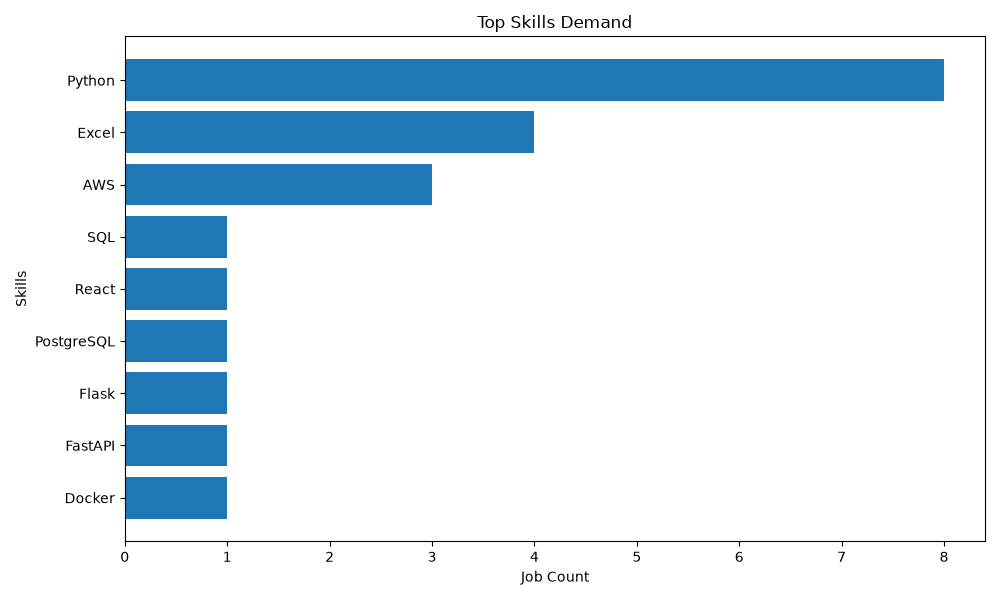
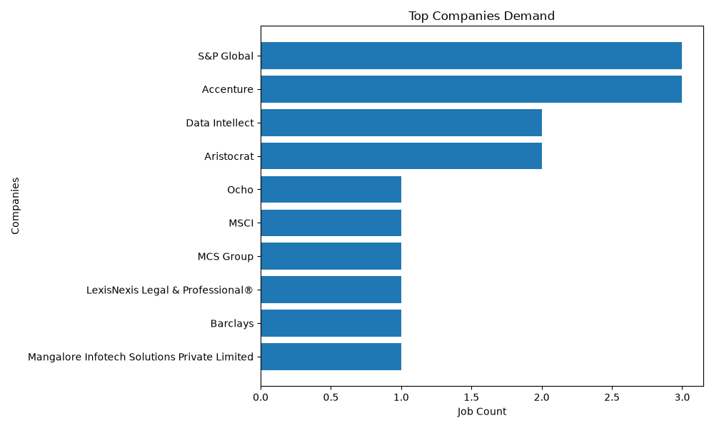

# Job Skill Demand Tracker

A Python-based data analytics project that collects job postings from the Adzuna API, stores them in SQLite, extracts skills from job descriptions, and analyzes current job market demand.

The project demonstrates an end-to-end data pipeline including API integration, database management, SQL analysis, data export, and visualization.

---

## Features

- Fetch job postings from the Adzuna API
- Store job data in SQLite
- Prevent duplicate records using UPSERT logic
- Extract skills from job descriptions
- Analyze in-demand skills
- Identify top hiring companies
- Export analysis results to CSV
- Generate visual reports using Matplotlib

---

## Tech Stack

| Category | Technology |
|-----------|------------|
| Language | Python |
| Database | SQLite |
| Data Analysis | Pandas |
| Visualization | Matplotlib |
| API | Adzuna API |
| Libraries | Requests, CSV, Datetime |

---

## Architecture

```text
Adzuna API
     │
     ▼
fetcher.py
     │
     ▼
SQLite Database
     │
     ├── jobs
     └── job_skills
     │
     ▼
skill_extractor.py
     │
     ▼
analysis.py
     │
     ▼
export.py
     │
     ▼
CSV Reports
     │
     ▼
visualize.py
     │
     ▼
Charts
```

---

## Project Structure

```text
Job-Skill-Demand-Tracker/

├── src/
│   ├── fetcher.py
│   ├── database.py
│   ├── skill_extractor.py
│   ├── analysis.py
│   ├── export.py
│   ├── visualize.py
│   └── main.py
│
├── results/
│   ├── top_skills.csv
│   ├── top_companies.csv
│   ├── top_skills.png
│   └── top_companies.png
│
├── requirements.txt
└── README.md
```

---

## Database Schema

### jobs

Stores job posting information.

| Column |
|----------|
| job_id |
| title |
| company |
| location |
| description |
| created |
| category |
| redirect_url |
| date_fetched |

### job_skills

Stores extracted skills associated with each job posting.

| Column |
|----------|
| job_id |
| skill |
| date_fetched |

Composite Primary Key:

```sql
PRIMARY KEY (job_id, skill)
```

This prevents duplicate skill entries for the same job.

---

## Example Results

### Top Skills Demand



Key skills identified from the sample dataset:

| Skill | Job Count |
|---------|-----------|
| Python | 8 |
| Excel | 4 |
| AWS | 3 |
| SQL | 1 |
| React | 1 |
| PostgreSQL | 1 |
| Flask | 1 |
| FastAPI | 1 |
| Docker | 1 |

---

### Top Hiring Companies



Top companies identified in the sample dataset:

| Company | Job Count |
|----------|-----------|
| S&P Global | 3 |
| Accenture | 3 |
| Data Intellect | 2 |
| Aristocrat | 2 |

---

## Skills Demonstrated

This project demonstrates practical experience with:

- API Integration
- SQLite Database Design
- SQL Queries
- JOIN Operations
- UPSERT Logic
- Data Extraction
- Data Cleaning
- CSV Export Automation
- Pandas
- Matplotlib
- Python Project Structure

---

## Getting Started

### Clone Repository

```bash
git clone https://github.com/yourusername/Job-Skill-Demand-Tracker.git
cd Job-Skill-Demand-Tracker
```

### Install Dependencies

```bash
pip install -r requirements.txt
```

### Configure Environment Variables

Create a `.env` file:

```env
APP_ID=your_adzuna_app_id
APP_KEY=your_adzuna_app_key
```

### Run

```bash
python src/main.py
```

Generated outputs will be available in the `results/` directory.

---

## Future Improvements

- Historical trend tracking
- Automated daily data collection
- Salary analysis
- Remote job analysis
- Geographic demand analysis
- NLP-based skill extraction
- Interactive dashboard using Streamlit

---

## Author

Built as a portfolio project to strengthen practical skills in:

- Python
- SQL
- Data Analysis
- Data Visualization
- API Development
- Database Design